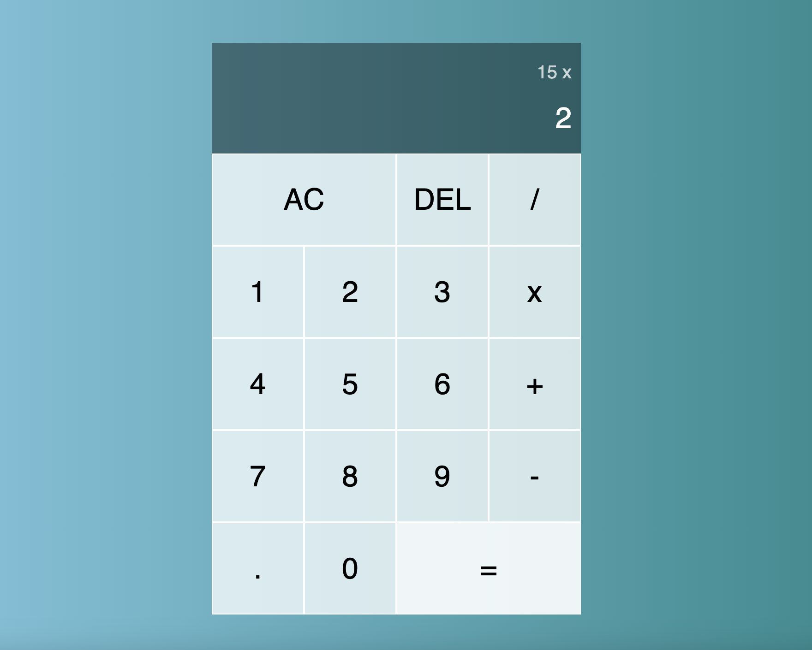
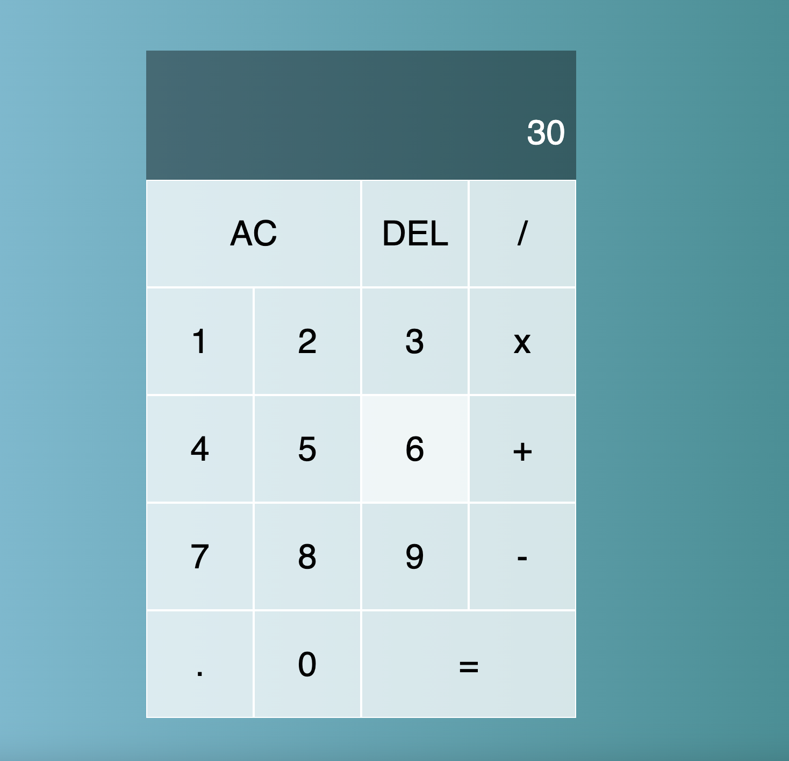
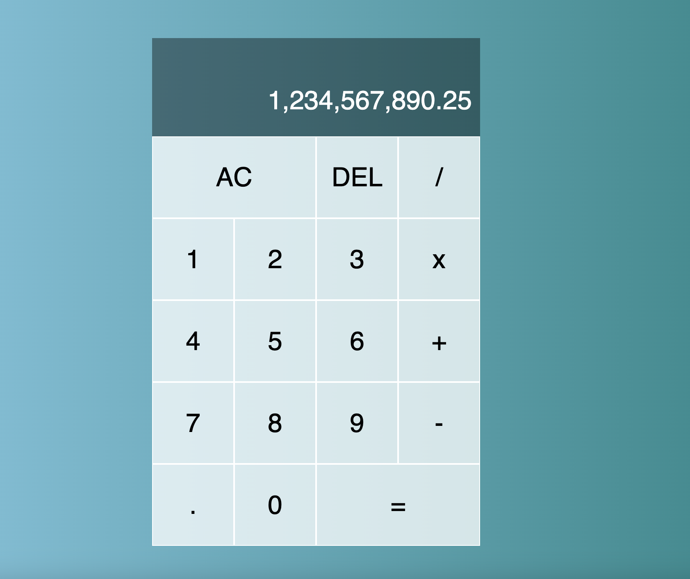

# calculator
## Project 5: Calculator built with JavaScript, CSS, and HTML (The Odin Project)

## Description: 
Welcome to my fifth web development project! This is part of my coursework in The Odin Project, a free, open-source curriculum to learn fullstack web development! 

This project was built in JavaScript, CSS, and HTML. 

The task for this project was to build an virtual calculator with an interactive UI. I hope you enjoy! 

## Links:
The full challenge description can be found here: https://www.theodinproject.com/lessons/foundations-calculator. 

## Screenshots:

